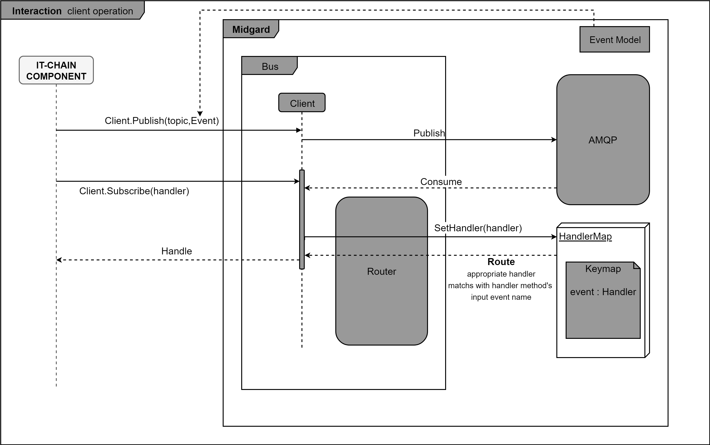

# midgard
Event sourcing library

## Bus Operation
<p align="center"></p>

## usage

```Go
import(
	"github.com/it-chain/midgard/bus/rabbitmq"
)

//create rabbitmq client
rabbitmqClient := rabbitmq.Connect(config.Common.Messaging.Url)
connectionHandler := NewConnectionCommandHandler(ConnectionStore, pri, pub, rabbitmqClient)

// Subscribe amqp server
// midgard를 사용하여 새 노드 연결 관련 이벤트 구독
err := rabbitmqClient.Subscribe("Command", "Connection", connectionHandler)
```
## Message
midgard에서 다루는 메시지의 구조체이다.

MatchingValue `string`
Data          `[]byte`

의 두 entity를 가지며 여기서 MatchingValue는 일반적으로 해당 데이터의 type의 이름을 나타낸다.

## rabbitmq / Client
Client는 발생한 이벤트의 핸들러를 지정할 뿐만 아니라 해당 핸들러의 실행까지 담당한다.

## Router
라우터는 data 와 handler의 이름을 받아 해당 handler를 실행한다.

### SetHandler(handler interface{}) error
handler should be a struct pointer which has handler method
this method register every method for event in HandlerMap so than when router is called, specific handler method deals with it.

### Route(data []byte, structName string) (err error)
`Route` calls specific handler function in handler map with handler struct name


---
